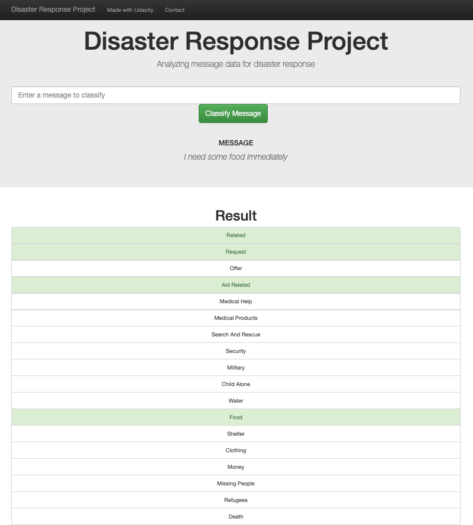

# Disaster Response: Message Classification

    
     
    <em>Digital Sculputre: Eyal Gever</em>

## Table of Contents

1. [Project Motivation](#project-motivation)
2. [Results](#results)
3. [Installation](#installation)
4. [File Descriptions](#file-descriptions)
5. [Licensing, Authors, and Acknowledgements](#licensing-authors-and-acknowledgements)

# Project Motivation
Following a disaster, typically millions of messages come flooding in, either directly or through social media.

This is a time when response agencies have the least capability to filter through the messages and filter out what’s important.

Typically only 1 in 1,000 messages are relevant to the disaster response professional.

The way the response works is that different organizations are responsible for different parts of the problem.

For this project, we will analyze approximately 25,000 messages that we received as tweets or text messages during a disaster.  We will further nvestigate trends within the data, and build supervised machine learning model to categorize the message and dispatch to the appropriate agency.

The project includes a web application, that will allow the user to post a message and extract the appropriate category to dispatch to the appropriate agency.

    
     
    <em>Word Classifer: Web Application</em>

