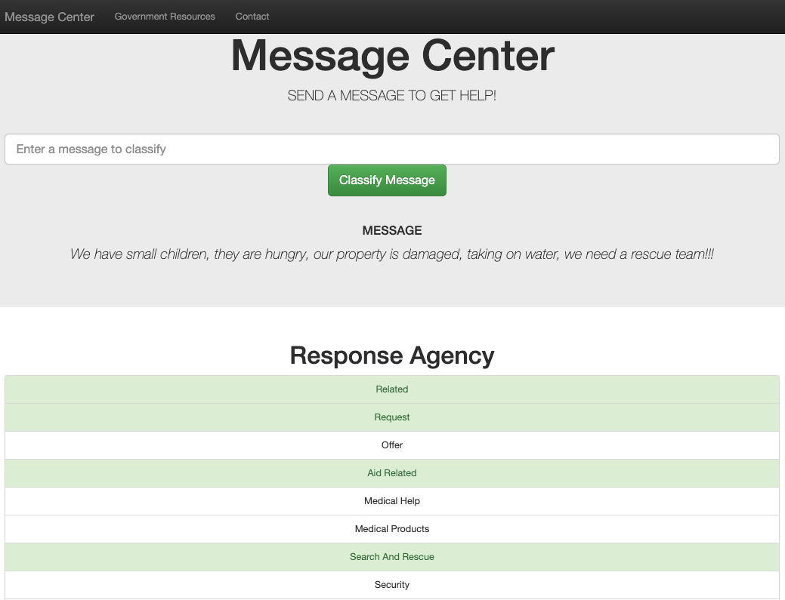

# Disaster Relief Response: Message Classification

<font size='4'>

<center>

<p align="center">
    
    <br>
    <font size='2'><em>Digital Sculputre: Eyal Gever</em></font>
</p>

</center>


# Project Overiew
The goal for this project is to create a web application to assist with a natural disaster response.<br>
<br>
Durring a natural disaster there are many agencies involved in responding to specific incidents that are part of the larger disaster.  Response agencies get floaded with messages from people in need of help.  Realistically, only a small percent of messages are real emergencies that require response.  This creates a challenge for responders, as they don't have the time and resources to sift through all the messages to find the ones that are real emergencies.<br>
<br>
To respond to this challenge, we've build a web application, powered by machine learning, that has been trained on 20,000 disaster response messages, from 36 different categories.  The application can take a message as input, analyze the words and identify the appropriate agencies that are required for response.<br>
<br>
Included in this project is an ETL pipeline to clean and load the data, a machine learning pipeline to train the model, and a web application to display the results.<br>
<center>

<p align="center">
    
    <br>
    <font size='2'><em>WebApp Dashboard</em></font>
</p>

</center>


# Data Cleaning


 To run the ETL script, navigate to the data folder and run the following command:
```bash
python process_data.py disaster_messages.csv disaster_categories.csv disaster_response.db
```
The script will extract the required data, transform into a usable format, and load it into a SQLite database.

# Machine Learning

```bash
python train_classifier.py DisasterResponse.db classifier.pkl
```

# Web Application
A web application was created to allow the user to input a message, and the model will categorize the message and dispatch it to the appropriate agency.

To run the web application, navigate to the app folder and run the following command:
```bash
python run.py
```
Type http://127.0.0.1:3000 in the web browser to access the web application from the internal webserver.

</font>