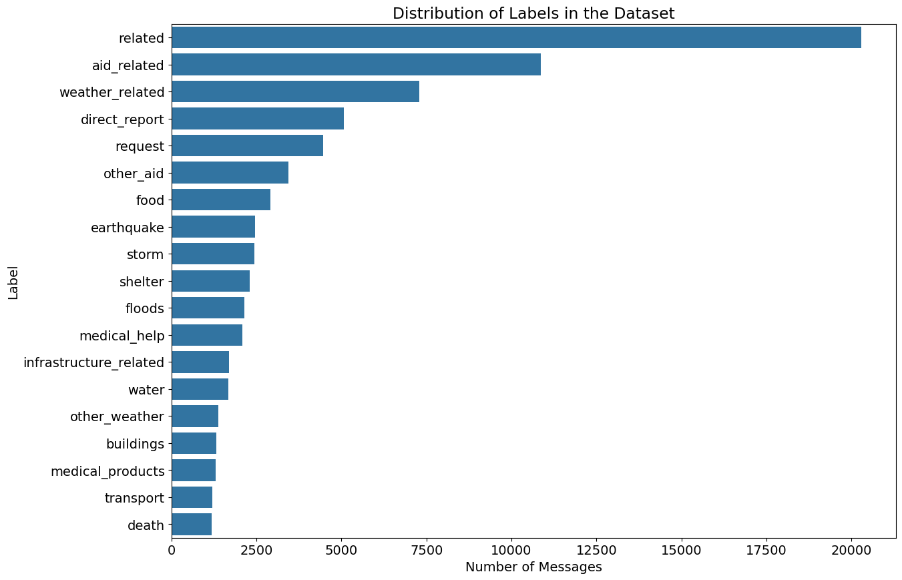
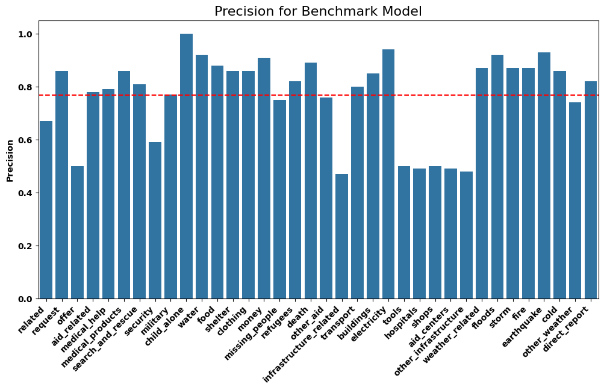

# Disaster Relief Response: Message Classification

<font size='4'>

<center>

<p align="center">
    
    <br>
    <font size='2'><em>Digital Sculputre: Eyal Gever</em></font>
</p>

</center>

# Table of Contents
1. [Project Overview](#project-overview)
2. [Data Analysis](#data-analysis)
3. [Data Cleaning](#data-cleaning)
4. [Machine Learning](#machine-learning)
5. [Web Application](#web-application)

# Project Overiew
The goal for this project is to create a web application to assist with a natural disaster response.<br>

<br>
Durring a natural disaster there are many agencies involved in responding to specific incidents that are part of the larger disaster.  Response agencies get floaded with messages from people in need of help.  Realistically, only a small percent of messages are real emergencies that require response.  This creates a challenge for responders, as they don't have the time and resources to sift through all the messages to find the ones that are real emergencies.<br>
<br>
To respond to this challenge, we've build a web application, powered by machine learning, that has been trained on 20,000 disaster response messages, from 36 different categories.  The application can take a message as input, analyze the words and identify the appropriate agencies that are required for response.<br>
<center>

<p align="center">
    
    <br>
    <font size='2'><em>WebApp Dashboard</em></font>
</p>

</center>
<br>
Included in this project is an ETL pipeline to clean and load the data, a machine learning pipeline to train the model, and a web application to display the results.<br>
<br>
The next sections will review the data cleaning process and machine learning workflows, followed by instructions to run the web application.

# Data Analysis
There were approximately 25,000 messages in the dataset.  These messages were assigned to 36 different categories.  These categories represent agencies that respond to messages.  It's possible for a message to be assigned to multiple categories.<br>
<br>

<center>
<p align="center">
    
    <br>
    <font size='2'><em>Top Response Categories from Messages</em></font>
</p>
</center>

The top 20 caetgories are associated with 93% of the messages analyzed.

# Data Cleaning
An ETL script was created to perform the data cleaning process.  The script will extract the data from two CSV files, the first containing messages and the second containing the disaster response categories.  The script will then transform the data into a usable format, and load it into a SQLite database.<br>

 To run the ETL script, navigate to the data folder and run the following command:
```bash
python process_data.py disaster_messages.csv disaster_categories.csv disaster_response.db
```
The script will extract the required data, transform into a usable format, and load it into a SQLite database.

# Machine Learning
We created a machine learning pipeline to process the incoming messages and classify them to the appropriate agency for response.  The pipeline uses two techniques for machine learning, the first is Natural Language Processing (NLP), we assign values to words based on frequency.  We also strip out words that don't provide meaning.  We then train two different machine learning classifiers, to classify the messages to the appropriate category.  We train two models with different hyperparameters to compare the results and achieve the best accuracy.<br>
<br>
We use Precision as an evaluation metric, as it's important to correctly classify messages to the appropriate agency.  We don't want to miss any real emergencies.<br>

<center>
<p align="center">
    
    <br>
    <font size='2'><em>Four Different Iterations of Training were Performed</em></font>
</p>
</center>
The Benchmark model was the most accurate approximately 40% of the time.<br><br>

There were four rounds of training performed, each with different hyperparameters, listed as follows:
1. Benchmark Model -  Random Forest Classifier with default hyperparameters
2. Grid Search Model - Random Forest Classifier with Grid Search hyperparameters (average of 15 models)
3. Best Params - Random Forest Classifier with best hyperparameters from Grid Search
4. XGBoost Model - XGBoost Classifier with Grid Search with best hyperparameters

<center>
<p align="center">
    
    <br>
    <font size='2'><em>Accuracy for Each Category</em></font>
</p>
</center>

The classifier performed above average for accuracy for two thirds of the response caetgories.  The classifier performed poorly for the remaining third of the categories.  This is likely due to the small number of messages in the dataset for these categories.

To train the classifier, navigate to the models folder and run the following command:

```bash
python train_classifier.py DisasterResponse.db classifier.pkl
```

# Web Application
A web application was created to allow the user to input a message, and the model will categorize the message and dispatch it to the appropriate agency.

To run the web application, navigate to the app folder and run the following command:
```bash
python run.py
```
Type http://127.0.0.1:3000 in the web browser to access the web application from the internal webserver.

</font>